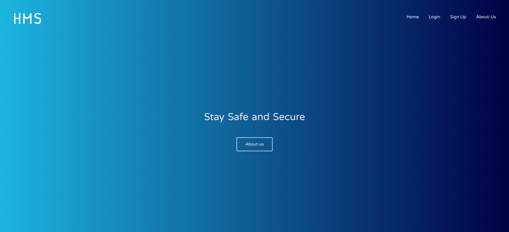
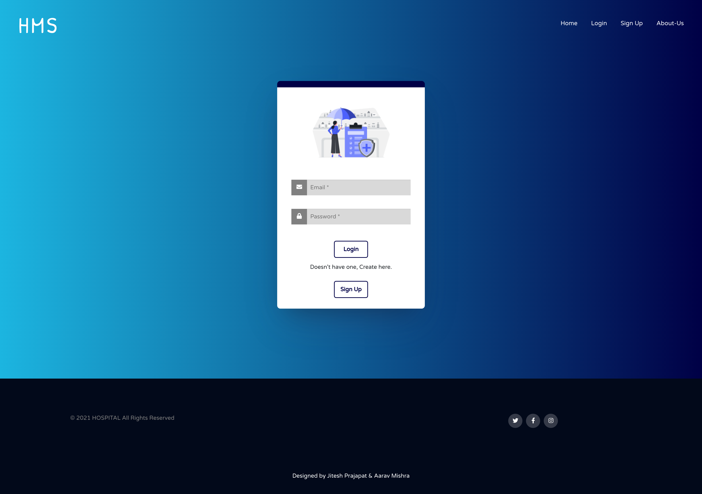
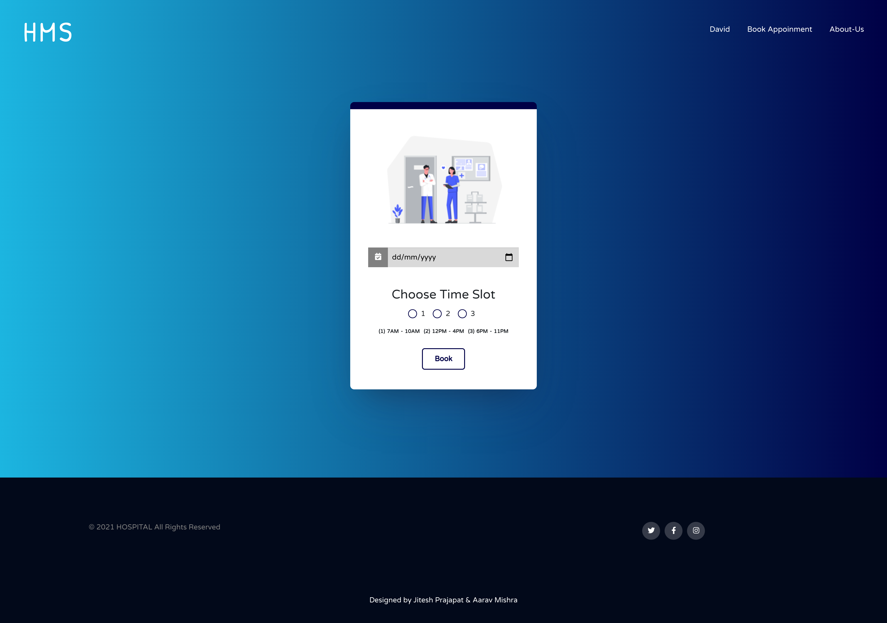
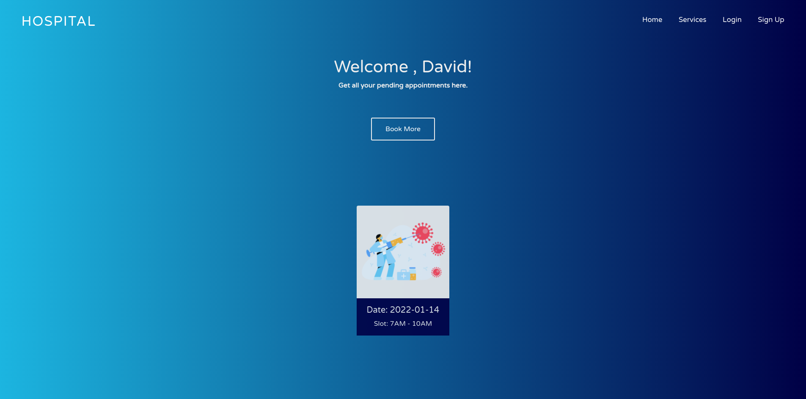
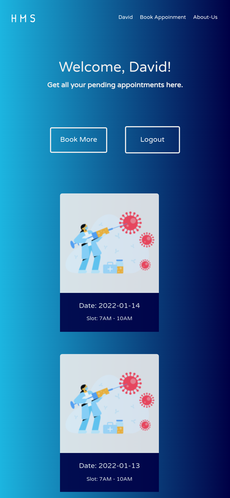
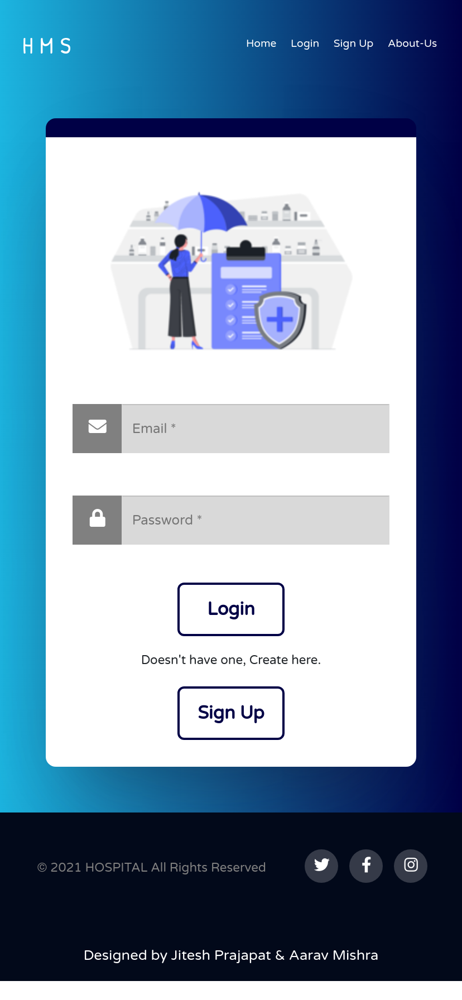

# Hospital Management System


<a href="https://hmsreact.vercel.app/">
  
</a>

## Description

A Dummy Web based applicaton for Hospitals where one can create their accounts and use our online system to book hassle free appointments.

## Tech Stack

**Client:** React

**Server:** Node, Express, MongoDB


## Run Locally

Clone the project

```bash
  git clone https://github.com/Aarav619/hms-frontend.git
```

Go to the project directory

```bash
  cd hms-frontend
```

Install dependencies

```bash
  npm install
```

Start the server

```bash
  npm run start
```


## Screenshots








&nbsp; &nbsp; &nbsp; 


## Feedback

If you have any feedback, please reach out to us at aaravmishra619@gmail.com


## Support

For support, email aaravmishra619@gmail.com 

